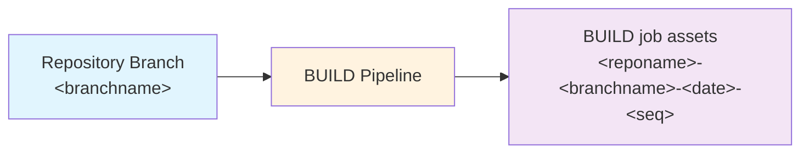

# Building Releases

The `BUILD` pipeline collates a numbered 'release' by extracting and building the assets required to deploy from source control. This can then be used later to deploy to any number of environments using the same exact unchanged assets.

The `BUILD` job triggers automatically when any changes are made in the associated repo, including when `EXPORT` completes (unless no changes were found).

To monitor:

1) Navigate to the 'Pipelines' area of your AzDO project.
2) Select the 'All' tab and navigate to the folder with the same name as your repo. (If you only have one repo, this will be the name as your project name by default).
3) Select the `BUILD` pipeline.
4) Select an instance of the job.
5) The view will switch automatically to show the progress of the pipeline. 
   Wait to make sure it is shown as successful.

What happens:

- Solution(s) are packed from the folders in source control at `solutions/uniquename` using PAC solution pack. A managed solution is generated and added to the build assets.
- If you've configured any 'hook' extensions in `alm-config.psd`, these will be executed and can add to the build steps and the assets. 
- Any additional paths configured in `assets` will be copied to the build assets.
- The configuration and scripts for the deployment process are also copied to the build assets to ensure that everything is frozen in time.

What to do next:

- The `DEPLOY-<branchname>` pipeline triggers automatically if the job completes successfully.
  See [Deploying](deploying.md) for information.
