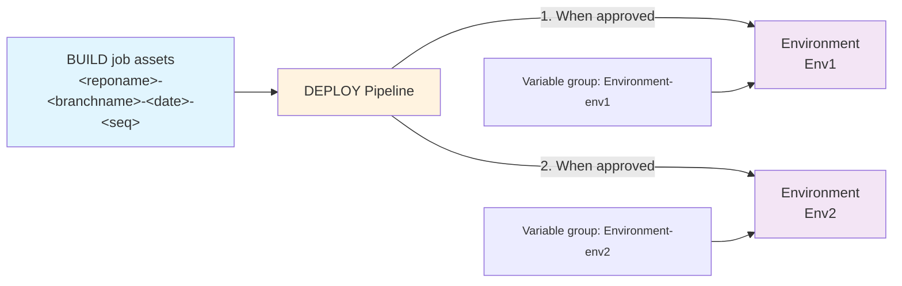

# Deploying

The `DEPLOY-<branchname>` pipeline deploys the assets from a set of build assets (chosen when it is started) and deploys them to one or more environments combining with environment specific settings.

The pipeline triggers automatically when the `BUILD` job completes successfully and triggers and instance associated with that release.

It is also possible to manually trigger the pipeline and manually select the relevant BUILD job from the 'resources' section (to define what version) and stages (to define which environment(s)) if you need to make an exception for some reason.

> **Which environments?**
>
> Each `DEPLOY-<branchname>.yml` pipeline is associated with a single branch and must be edited to configure with a list of the environments that it will deploy to in the sequence they are listed.
>
> Each environment requires a [service connection](../config/environment-service-connection.md) to define the URL and auth parameters and [variable group](../config/environment-variable-group.md) to define environment specific values.
>
> When adding environments, don't forget to add the following policies to the variable group:
> - Exclusive lock
    Makes sure only one deployment at a time can touch the environment
> - Approval
>   Ensures that deployment will only go ahead once 'approved'.

To monitor:

1) Navigate to the 'Pipelines' area of your AzDO project.
2) Select the 'All' tab and navigate to the folder with the same name as your repo. (If you only have one repo, this will be the name as your project name by default).
3) Select the `BUILD` pipeline.
4) Select an instance of the job.
5) Each environment is displayed as a 'Stage' with a status showing which one is currently active.
6) If the stage is pending approval, it will be displayed and the configured approvers must approve it before deployment will start. 
7) One approved (if configured), the deployment stage will start.
   You can select the stage to follow progress and check it completes successfully.

One a stage completes successfully, the next stage will be started.

If a stage fails, you can see the detailed error. You can select 'Retry stage' to give it another go.

What happens for each deployment stage:

- **The pipeline waits for all configured policies to be met.**
  For instance the exclusive lock and approval steps.
- **The build assets generated by the selected instance of `BUILD` are downloaded.**
  This is defaulted to the triggering instance when the deployment job starts if the job was automatically triggered, or can be selected manually if triggering manually.
- **The name of the deployment job matches the release number.**
- **Environment settings are read from the variable group associated with the environment**, matching with those required by each solution.
- **Solutions are deployed if needed in the configured dependency order**:
  - If the solution is already present with the same version, the import is skipped.
  - If the solution is not currently present in the environment, the 'Import' method is used
  - If there's a pending unmerged upgrade with a different version, and error is thrown with details asking you to resolve it. This is not automated because it can result in data loss. You either need to remove (warning - data loss) or apply the prior upgrade before retrying.
  - If there's a pending upgrade for the same version, the 'Stage for upgrade' is skipped
  - If the solution is already present with a different version the 'Update' (if Major.Minor matches) or 'Stage for Upgrade' method is used 
- **If you've configured any `dataMigrations` 'hook' extensions in `alm-config.psd`, these will be executed**.
  This stage is designed to let you run steps that need both the old and new components to be present. For instance, moving data from an old/obsolete column (which is no longer present in the solution version being upgraded to) and into a new column.
- **Solutions that have a pending upgrade then have them applied in reverse dependency order**.
- **If you've configured any 'hook' extensions in `alm-config.psd`, these will be executed and can add to the deployment steps consuming files from the build assets.**
   For example you might deploy data you captured during export.