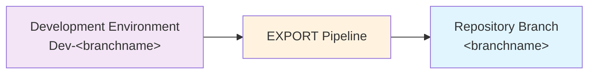

# Exporting Changes

The `EXPORT` pipeline for each repo takes the state of the solutions(s) (and other assets like data if you include them) in your development environment, and exports them to the source control repo.

> **When to export changes**
>
> You should export changes frequently. There's no need to wait until you're ready to deploy. Exporting saves your work into source control where it's safe as well as creating a useful history at every point you run it.
>
> Exporting take all changes to the configured solutions (and other assets) from the associated environment. There is deliberately no method to select and segregate changes. So you might need to co-ordinate with other changes you or team members have made.

> **Which environment?**
>
> ALM4Dataverse uses a convention-based approach to associate each branch with a development environment. It looks for a service connection with the name `Dev-<branchname>` for example `Dev-main`.

1) Navigate to the 'Pipelines' area of your AzDO project.
2) Select the 'All' tab and navigate to the folder with the same name as your repo. (If you only have one repo, this will be the name as your project name by default).
3) Select the `EXPORT` pipeline.
4) Click `Run pipeline`
5) If you're using multiple branches, select the correct branch from the list. Otherwise, it will default to `main`.
6) Enter the commit message.
   This is the message that will be logged in the source control history against the changes you are exporting. If you include ticket (bug/user story) numbers with `#1234 #2345` format, the changes will also be shows against those tickets in the 'Development' section.
6) Select 'Run' action.
7) The view will switch automatically to show the progress of the pipeline. 
   Wait to make sure it is shown as successful.

What happens:

- Solution are exported and unpacked (using PAC solution unpack) to `solutions/<uniquename>`
- If any changes were detected in a solution, the version number will be automatically incremented in your dev environment and the exported solution folder.
- If you've configured any 'hook' extensions in `alm-config.psd`, these will be executed and can add to the exported changes that get committed to your repo. For example, you can include configuration data. 
- Changes (if any) are committed with the comment you provided and pushed back to the repo.
  The details of the person who triggered the pipeline will be used as the author.

What to do next:

- The `BUILD` pipeline triggers automatically when any change is made in a repo. This includes when `EXPORT` completes (if any changes were detected).
  See [Building Releases](building-releases.md) for information.

## Viewing Exported Changes

1) Navigate to the 'Repos' section of Azure DevOps and select the correct repo and branch (if using several)
2) Switch to the 'History' view.
3) Each 'commit' (set of changes) is displayed along with comments.
4) Click the commit comment to see the full set of changes included.