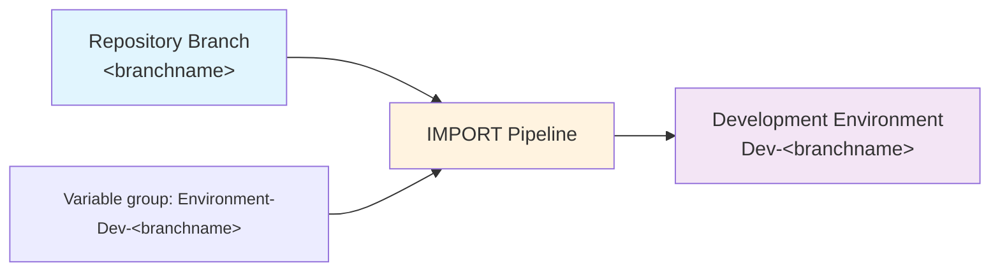

# Importing Changes

The `IMPORT` pipeline for each repo is used:

- When you have an empty development environment and you want to seed it from source control so you can start development.
- When you have an existing development environment and you want to update it with any changes from source control.

> **Which environment?**
>
> ALM4Dataverse uses a convention-based approach to associate each branch with a development environment. It looks for a service connection with the name `Dev-<branchname>` for example `Dev-main`.

1) Navigate to the 'Pipelines' area of your AzDO project.
2) Select the 'All' tab and navigate to the folder with the same name as your repo. (If you only have one repo, this will be the name as your project name by default).
3) Select the `IMPORT` pipeline.
4) Click `Run pipeline`
5) If you're using multiple branches, select the correct branch from the list. Otherwise, it will default to `main`.
6) Select 'Run' action.
7) The view will switch automatically to show the progress of the pipeline. 
   Wait to make sure it is shown as successful.

What happens:

- The import process follows the same steps as `DEPLOY` except:
  - it uses the latest files from the repo
  - it imports an unmanaged solution instead of managed solution.
- Where environment variables, connection reference mappings and other settings are required, they will be read from the `Environment- DEV-<branchname>` variable group. See [the information about variable groups](../config/environment-variable-group.md) for more info.